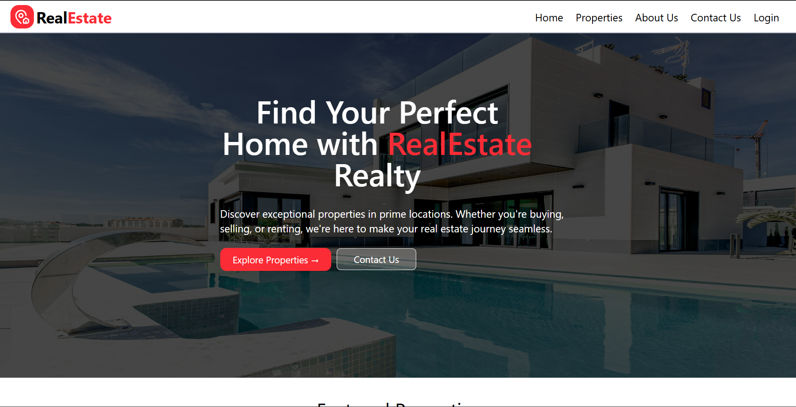
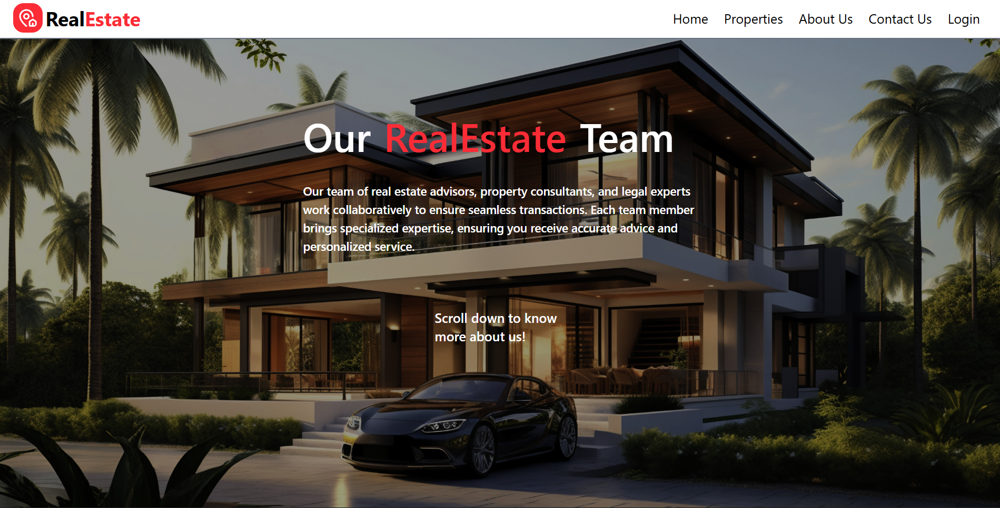
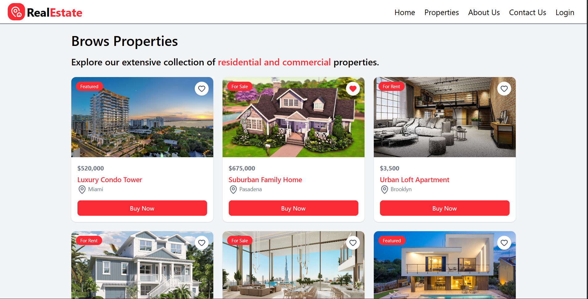
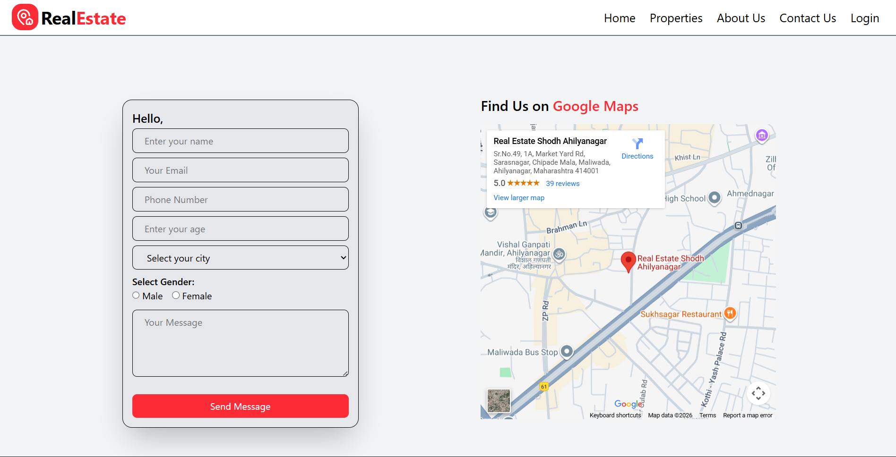

# RealEstate

Welcom to **RealEstate** a website where you can find the dream properties in your budget. RealEstate is a responsive web application built to showcase real estate services, company details, and contact information. The website is designed with a clean layout and smooth user experience using modern frontend technologies.

---

Click Here to visit our website [Click Here]()

---

## Key Features
- Modern and clean user interface built with Tailwind CSS

- Component based architecture using React for better scalability and maintenance

- Professional About Us page with structured company information

- Hero section with image overlay and clear messaging

- Optimized images for better performance and visual quality

- Easy navigation using reusable Navbar and Footer components

---

## project Structure

- `index.html` -main landing page
- `components\` - components which can be used multiple times in code
- `assets\` - Images Folder
- `view\` - Pages Folder
- `config\` - Storing Customers and property info
- `view/About` - About page of the website
- `view/Contact` - Contact page of the website
- `view/Contact` - Contact page of the website
- `view/Home` - Home page of the website
- `view/SignIn` - SignIn page of the website
- `view/Property` - Property page of the website

## Screenshots
- Home Page

---
- About us

---
- Property Page

---
- Contact Us

---